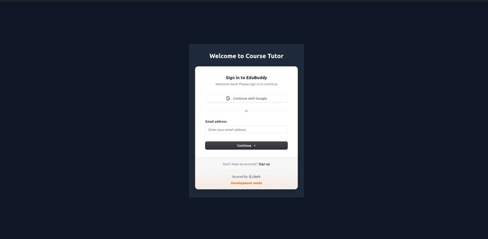
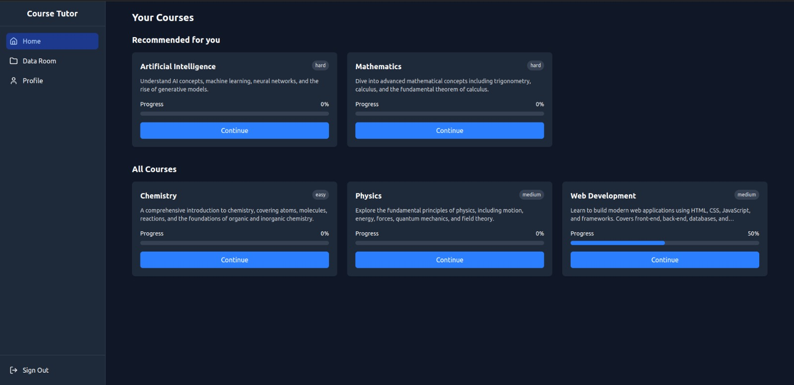
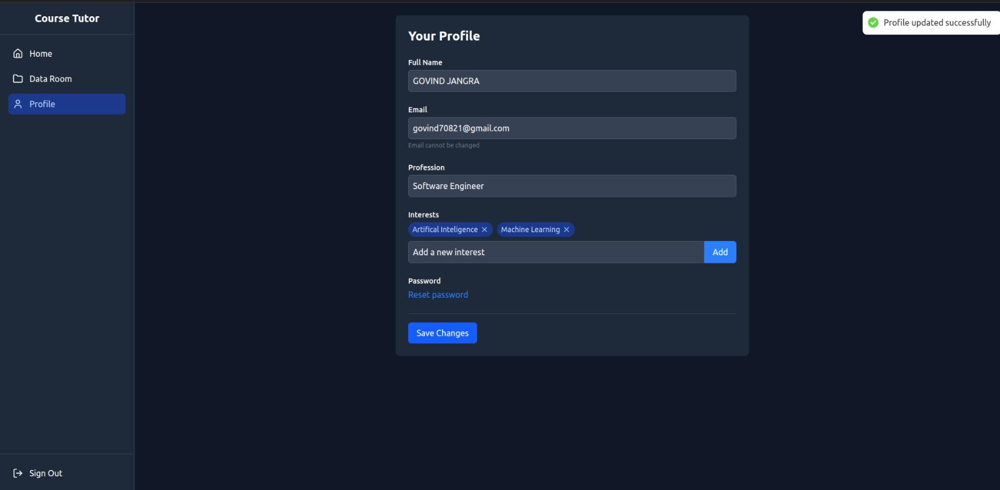
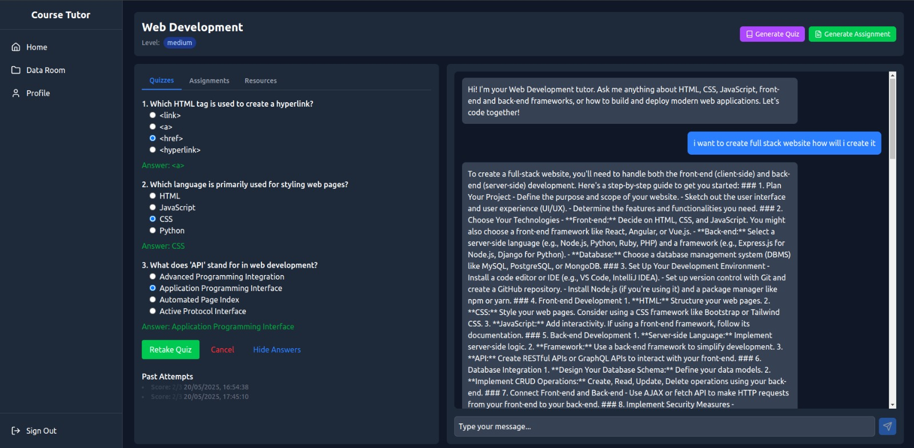
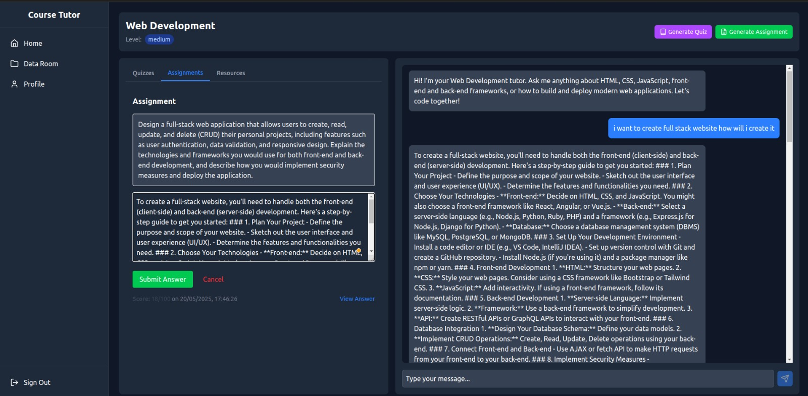
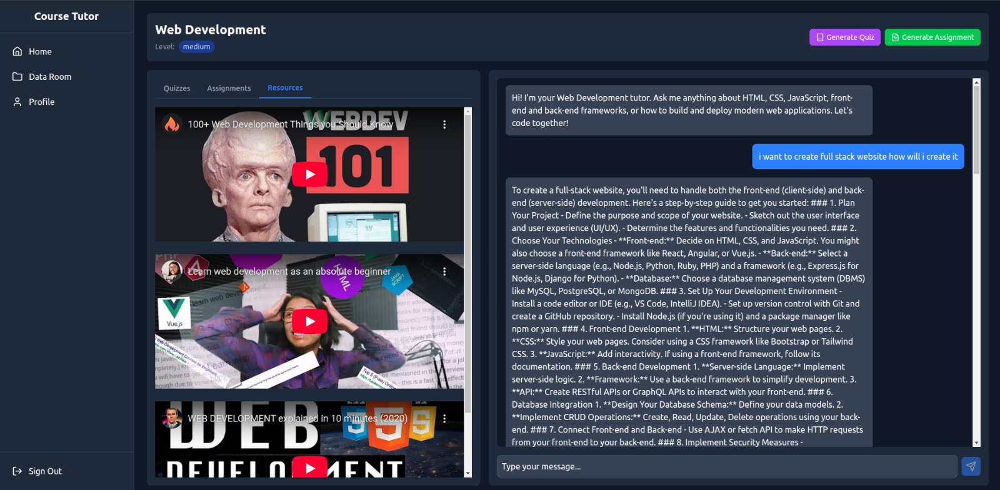
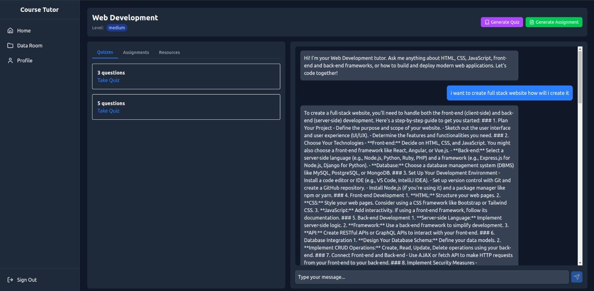

# EduBuddy


Welcome to **EduBuddy**, an AI-powered learning assistant designed to make education accessible, personalized, and effective — especially for students in underserved and rural areas of India.

EduBuddy addresses the lack of personalized support in large-scale, low-cost online learning models by delivering 24/7 guidance, real-time feedback, adaptive content, and intelligent progress tracking.

---

## Problem Statement

Millions of learners across India, particularly in rural areas, lack access to affordable and personalized digital education. Existing platforms often rely on static, one-size-fits-all content, leading to high dropout rates and poor learner engagement.

**Learning Buddy bridges this gap** by offering a virtual AI companion that supports personalized learning journeys at scale.

---

## Stakeholders

- **Students**: School and college learners in urban and rural areas seeking affordable, personalized help.
- **Working Professionals**: Individuals aiming to upskill or reskill with flexible, self-paced learning.
- **EdTech Companies**: Platforms striving to improve engagement and outcomes while minimizing support costs.

---

## Key Features

### Seamless Onboarding
A smart onboarding wizard captures learner goals, current skill levels, and available time to automatically generate personalized learning plans tailored for individual progress.

### Centralized Dashboard
Unified dashboard interface for learners to monitor course progress, resume incomplete modules, and access key actions — all in one place.

### Smart Resource Management
Enables structured access to curated learning materials for each course. Upload and download support will be added soon as part of the DataRoom integration.

### Adaptive Study Flow
Each topic is broken into interactive components to maximize retention:
- Diagnostic quizzes to assess readiness
- Customized lessons with auto-generated content
- Instant AI-powered Q&A support
- Auto-generated quizzes and assignments
- Smart reminders for upcoming deadlines

### Progress Tracking
Graphical progress indicators help learners stay consistent and on track throughout their journey.

### Smart Quiz Generator
- Automatically generates quizzes based on selected topics and past performance.
- Provides real-time scoring and detailed feedback with hints.

### Dynamic Assignment Builder
AI-curated assignments that evolve in difficulty based on performance.

### Curated YouTube Integration
Suggests high-quality, relevant videos based on the user’s learning path.

### AI-Powered Conversational Tutor
Integrated chatbot to answer context-specific questions using course materials.


---

## Screenshots

### Login Page



### Courses


### Profile Page


### Quizzes


### Assignments


### Resources


### 🤖 AI Tutor


---

## Future Scope

- **Cloudflare Workers for AI Embedding**: Planned integration to enable high-performance, serverless AI vector embeddings.
- **DataRoom File Management**: Upcoming feature to allow learners to upload, manage, and access their files and notes within the platform.
- **Multilingual Support**: Add support for regional languages to make the platform accessible to a broader audience.  
- **Offline Functionality**: Allow learners to download content and continue learning without active internet access.
---

## Backend (Node.js + Express + MongoDB)
- RESTful APIs for managing:
  - Users
  - Courses
  - Quizzes
  - Assignments
  - File uploads (DataRoom)
- Authentication via Clerk with SSO callback support
- User progress tracking and profile updates
- MongoDB models for structured data storage


## Frontend (React + Vite)
- Authentication and structured routing (Private & Public Layouts)
- Course and Quiz Management UIs
- Modals and Cards for adding/viewing course data
- Resources tab for course-specific learning materials

---

## Project Structure

```bash
├── Backend                 # Express server with routes and controllers
├── cloudflare-worker      # Cloudflare functions for vector operations
├── react                  # Frontend React app using Vite
├── README.md              # This file
├── .gitignore             # Git ignore rules
└── package-lock.json      # NPM dependency lock
```

## Setup Instructions

### Backend
cd Backend <br>
npm install <br>
cp .env.example .env   # Set your MongoDB URI and Clerk keys here <br>
npm start <br> 


### Frontend
cd react <br>
npm install <br>
npm run dev <br> 


## Authentication
- Clerk is used for user authentication (SSO support)
- Auth middleware is integrated into protected routes

---

## Tech Stack

- **Frontend**: React, Vite  
- **Backend**: Node.js, Express.js, MongoDB  
- **Auth**: Clerk  
- **Other**: Groq integration, REST API

---

## Contact
For queries or collaboration requests, feel free to reach out to the contributors on GitHub.

---

> Empowering every learner — anywhere, anytime — with the guidance they deserve
